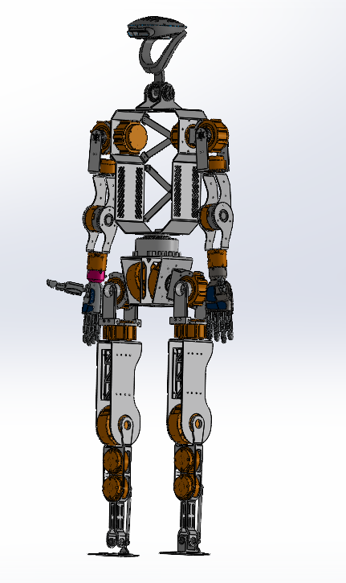

# Humanoid Inverse Dynamics — Multibody Dynamics Workflow

Inverse dynamics and multibody dynamics workflow for **bipedal humanoid robots**,
built in **MSC Adams**, focusing on **joint torque estimation** for a lower-limb
humanoid platform.

> **Status — ongoing DRDO research project.** This work is active and under
> confidentiality obligations, so **nothing from the project can be added here** —
> no CAD models, MSC Adams files, simulation outputs, joint-torque results, robot
> parameters, or internal reports. This page documents the workflow only.

---

## Overview

The goal is to estimate how much torque each joint (hip, knee, ankle) needs to
produce a prescribed motion. **Inverse dynamics** solves for the joint torques and
reaction forces required to generate that motion. Those torque profiles feed real
design decisions — actuator and gearbox selection, structural sizing, and power
budgeting.

The leg is modelled as a **multibody system** of rigid links connected by joints,
with mass and inertia on each body and foot–ground contact defined. **MSC Adams**
assembles the model, drives it along the prescribed motion, and solves the
equations of motion to recover the joint torques.

## Multibody model



## Workflow

1. **Multibody model** — represent the lower limb as rigid links connected by hip,
   knee, and ankle joints, with mass and inertia assigned to each body.
2. **Prescribe motion** — impose the desired joint motion / reference trajectory.
3. **Constraints & contact** — define the kinematic constraints and foot–ground
   contact that make the motion physically consistent.
4. **Inverse-dynamics solve** — solve the equations of motion in MSC Adams for the
   torques and reactions required to produce that motion.
5. **Joint torques & reactions** — recover the hip, knee, and ankle torque time
   histories.
6. **Post-processing** — extract and visualise the torque results in MATLAB / Python.

## Tools & skills

MSC Adams (multibody modelling and inverse-dynamics solution), inverse dynamics,
joint torque estimation for actuator sizing, and post-processing in MATLAB / Python.

## Repository layout

```
humanoid-inverse-dynamics-workflow/
├── README.md
├── LICENSE
├── .gitignore
└── docs/
    ├── cad_model.png          # generic multibody link–joint schematic
    └── dynamics_pipeline.png   # inverse-dynamics workflow diagram
```

## Confidentiality

The diagrams above are generic and contain no project geometry, parameters, or
results. Because the DRDO project is ongoing, all proprietary content — CAD,
MSC Adams files, numerical results, dimensions, mass properties, and controller
parameters — is deliberately excluded.

## License

Released under the MIT License — see [`LICENSE`](LICENSE). It applies to this
repository's contents only and confers no rights over any DRDO project data,
models, or results.
